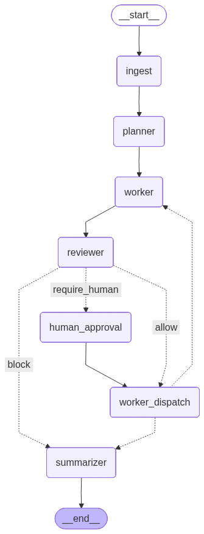

# Project 7 — Industry-Integrated AI Synthesis


**AI Security Operations Copilot** — an agent-led SOC copilot that ingests surveillance events and access-control logs, correlates them into risk-scored incidents, retrieves relevant policies, generates analyst-facing summaries with `doc_id` citations, and escalates critical cases through a non-bypassable human-approval gate.

This is the **final synthesis capstone** (Project 7) of the Udacity AI Mastery Capstone. It integrates methods from **five** prior projects into one industry-focused solution.

---

## What this is

A working vertical slice that proves a single architectural bet: that **rules-first fusion + RAG-grounded summarization + non-bypassable policy gates** compose into a system SOC analysts would want to be the *closer* on, not the *typist* on. The thesis is operator-centered — the copilot replaces the part of the shift that's a log-stitcher and a 3am paragraph-writer; the operator keeps judgment, override, and accountability.

On the scaled slice (P1's full corpus):
- **3 sites, 1,000 surveillance events, 9,702 access logs**
- **226 risk-scored incidents** (210 high + 16 critical)
- **16 critical escalations** routed through the human-approval gate; the agent never auto-closes
- **34 tests green across 5 files** (13 governance/policy in `test_governance_no_domain_imports.py` + `test_policy_predicate.py`; 2 escalate-blocked; 3 P2 threshold-calibration; 16 upload-adapter)

The notebook is tested with **Restart & Run All clean (0 errors across 30 cells)**.

> **This is a research / portfolio project**, not a production SOC tool. The copilot runs on P1's synthetic corpus, not a real environment; the Streamlit GUI is local-only; the audit chain, citation guard, and policy gate are what make this defensible on synthetic data, not what make it production-ready. See **Honest limitations** below.



---

## Rubric at a glance

The P7 capstone rubric (synthesis paper, system, defense) maps to this repo as follows. If you have 15 minutes, open the linked file in column 3; if you have 2, read the row in column 2.

| Rubric section | What this project shows | Where to look |
|---|---|---|
| Industry problem & appropriateness | SOC alert fatigue and cross-screen correlation; the bet that rules-first fusion + RAG-grounded summarization + a non-bypassable policy gate compose into something an analyst would actually want. | README §"What this is" + paper §1 |
| Integration of ≥3 prior projects | **Five** prior projects wired into one pipeline (P1 data, P2 calibration contract, P3 leakage discipline, P5 generative prose, P6 LangGraph governance spine). | README §"Five prior projects" + paper §2 |
| System design & technical decisions | Five subsystems (Generators → Fusion → RAG → Summarizer → Agent) wired with a documented Mermaid data flow. Key decisions: rules-first, category-routed RAG, citation guard, non-bypassable escalation gate. | README §"Pipeline" + paper §3 |
| Ethical considerations & responsible AI | PII redaction, scope minimization, human-in-the-loop on irreversible actions, hash-chained audit, calibration honesty (the 0.85 recall finding surfaced to operators, not hidden). | README §"Human-in-the-loop gate" + paper §4 |
| Evaluation & reflection | 34/34 tests green, RAG self-check passes, P2 calibration re-confirmed, four latent bugs caught and fixed. | README §"Honest limitations" + paper §5 |
| Professional relevance | The system + paper + notebook + graph + tests + GUI together form a cohesive portfolio piece. | README §"What the operator sees" + paper §6 |

---

## Five prior projects, one system

| Project | Contribution to P7 | Evidence |
|---|---|---|
| **P1** (Programming Foundations) | The copilot runs on P1's full corpus. `p1_pipeline.py` reads P1's `data/raw/*.parquet` (1k events / 10k logs / 3 sites) through `p1_adapter.py` to normalize the schema. | `src/generators/p1_pipeline.py`, `src/utils/p1_adapter.py` |
| **P2** (Statistical Analysis) | The rule engine's confidence threshold is **calibrated** against P2. P2's chi-square + t-test are re-run on the slice the copilot runs against. P2's "validate against precision/recall before deployment" caveat is confirmed as a hard finding: **recall@0.85 = 58%** (Cohen's d 0.21 → 1.50). | `tests/test_threshold_calibration.py`, notebook §2b |
| **P3** (Applied ML) | Rules-first discipline + the leakage-audit lesson. Fusion is rules-only; any future ML upgrade must split by the independence unit (`site` + `time_window`), not shuffled rows. | `src/fusion/rules.py`, `src/fusion/risk_scorer.py` |
| **P5** (Generative AI) | The char-level Transformer on CSIRT/CERT/NIST incident-handling prose is the summarizer's **genre reference** (NIST SP 800-61 / CSIRT response style). The summarizer itself is a citation-grounded LLM call, not the P5 model. | `src/agent/summarizer.py` |
| **P6** (Agentic AI) | The LangGraph governance spine (`src/governance/`) is lifted from the property-management donor and adapted with one required fix (the multi-step plan loop dispatches back to `worker`, not `reviewer`; documented with `FIX` comments in `src/governance/nodes.py`). The non-bypassable policy gate that hard-blocked P6's eviction/lockout is reused as P7's human-in-the-loop for `risk_band = critical`. | `src/governance/`, `src/domain/` |

---

## Pipeline

```
P1 raw parquet (project_01_.../data/raw/*.parquet)
        │
        ▼  p1_adapter.py (drop sentinels, normalize zone_id, derive anomaly)
surveillance_events (1k) + access_logs (9.7k)
        │
        ▼  src/fusion/  (4 rules: intrusion_restricted, repeated_denials, cross_anomaly, tailgate_door)
226 risk_scored incidents (210 high + 16 critical)
        │
        ▼  tests/test_threshold_calibration.py  (P2 calibration contract)
        │
        ▼  src/rag/  (Chroma + all-MiniLM-L6-v2 + MMR + category routing)
        │     retrieve_for_incident(incident_type) → KB-XXXXX
        │
        ▼  src/agent/summarizer.py  (Groq llama-3.1-8b-instant, citation guard)
        │     summary_text + recommended_action + citation_doc_ids
        │
        ▼  src/agent/copilot_agent.py  (LangGraph)
              fuse → score → retrieve → summarize → escalate(human_approval)
              case.close is hard-blocked (allow: false)
```

The agent's audit log is hash-chained JSONL; every tool call, reviewer verdict, and human-approval is recorded with `doc_id` traceability for the post-incident review.

**Optional analyst front-end:** the same `run_incident_streaming` entry point is reused by `src/gui/app.py` (Streamlit). The GUI surfaces the same audit chain, the same human-approval gate as a real Grant/Deny button, and an optional "📁 Upload your data" path: drop in two CSVs in any schema, map the columns and enum values via the GUI's `data_editor` widgets, and the copilot runs on the analyst's own data instead of the project corpus. Uploads live in `data/uploads/{uuid}/` and never touch the project's `data/synthetic/` parquet.

---

## Quick start (5 minutes)

```powershell
# 1. Activate the project venv
project_07_final_synthesis\final_venv\Scripts\python.exe -m project_07_final_synthesis.src.generators.run_all
project_07_final_synthesis\final_venv\Scripts\python.exe -m project_07_final_synthesis.src.fusion.incidents
# (the retriever --build step below also runs the knowledge_base_loader; one call does both)

# 2. Build the policy-KB vector store + run the RAG routing self-check
project_07_final_synthesis\final_venv\Scripts\python.exe -m project_07_final_synthesis.src.rag.retriever --build
project_07_final_synthesis\final_venv\Scripts\python.exe project_07_final_synthesis\scripts\check_rag.py --k 3

# 3. Run the agent on the seeded critical incident
project_07_final_synthesis\final_venv\Scripts\python.exe -m project_07_final_synthesis.src.agent.copilot_agent --incident INC-000001

# 4. Run the test suite
project_07_final_synthesis\final_venv\Scripts\python.exe -m pytest project_07_final_synthesis\tests\ -v
```

For the LLM summarizer, create `project_07_final_synthesis/.env` with one line:
```ini
GROQ_API_KEY=gsk_...
```
(Free key at https://console.groq.com/keys.) The deterministic pipeline (generators, fusion, RAG, stub-mode agent) runs without any key.

To run the rubric submission notebook:
```powershell
project_07_final_synthesis\final_venv\Scripts\python.exe project_07_final_synthesis\scripts\build_notebook.py
```
Then open `notebooks/07_integrated_copilot.ipynb` in JupyterLab.

There's a second, **self-contained companion notebook**: `notebooks/full_copilot.ipynb`. It inlines every module (generators → fusion → RAG → summarizer → governance-gated agent) with **no `from src...` imports**, so a reviewer can trace the whole system top-to-bottom in one file. Rebuild it with:
```powershell
project_07_final_synthesis\final_venv\Scripts\python.exe project_07_final_synthesis\scripts\build_full_notebook.py
```
Same behavior as the rubric notebook, different altitude — it runs the small slice by default and includes the §2b P2→P7 calibration section. It runs in LLM mode when `GROQ_API_KEY` is set (non-deterministic: the citation guard may return `ok` or `needs_review`, both correct) and falls back to deterministic stub mode with no key.

To launch the **Streamlit analyst GUI** (one command, runs in your browser):
```powershell
project_07_final_synthesis\final_venv\Scripts\python.exe -m streamlit run project_07_final_synthesis\src\gui\app.py
```
Pick an incident in the sidebar, press **▶ Run copilot**. Critical-band incidents show a real **Grant/Deny** gate before the agent dispatches `incident.escalate`. Default is stub mode (deterministic, no API key). Tick "Use LLM" and paste a `gsk_…` key into the GUI's textbox to enable the LLM summarizer; the typed key is the only source — the GUI never reads `.env` for it. Use the **📁 Upload your data** section to drop in your own surveillance + access CSVs (any schema; map columns and enum values via the GUI's `data_editor` widgets) and the copilot runs on the analyst's own data instead of the project corpus.

---

## Project structure

```
project_07_final_synthesis/
├── data/
│   ├── reference/                          # sites, zones, devices, users (shared seed data)
│   ├── operational/                        # surveillance_events, access_logs, incidents
│   ├── knowledge_base/                     # JSONL policies + Chroma vector store
│   ├── synthetic/                          # deterministic Parquet + CSV outputs (project corpus)
│   └── uploads/                            # per-session CSV uploads (data/uploads/{uuid}/)
├── notebooks/
│   ├── 07_integrated_copilot.ipynb         # rubric submission (30 cells, runs the scaled P1 slice via `from src...`)
│   └── full_copilot.ipynb                  # self-contained companion: the whole system inlined, no `from src...` imports (53 cells)
├── src/
│   ├── generators/                         # reference_data + surveillance_events + access_logs + p1_pipeline
│   ├── fusion/                             # rules + risk_scorer + incidents (4 detectors)
│   ├── rag/                                # knowledge_base_loader + retriever (MMR + category routing)
│   ├── agent/                              # copilot_agent + summarizer (Groq adapter)
│   ├── governance/                         # lifted from P6 donor (graph_builder, policy, audit, ...)
│   ├── domain/                             # SOC-specific (policy.yaml, tools, intake, prompts)
│   ├── gui/                                # Streamlit analyst GUI (one-file app)
│   ├── schema.py                           # dataclasses + INCIDENTS_COLS etc.
│   └── utils/                              # constants (SEED=42), io, p1_adapter, upload_adapter
├── tests/                                  # 34 tests: governance + policy + escalate + threshold + upload-adapter
├── reports/
│   ├── agent_graph.png                     # compiled LangGraph topology
│   └── Reflective_Synthesis_Paper.pdf
│   └── Reflective_Synthesis_Paper.md
├── final_venv/                             # pinned venv (see requirements.txt for the exact freeze)
├── requirements.txt                        # pip freeze of final_venv (+ streamlit 1.59.2 stack)
└── README.md                               # this file
```

---

## What the operator sees

The copilot changes the SOC analyst's job from *triage everything* to *verify what matters*. On the scaled slice:

- **Inbox:** 226 ranked incidents (vs. ~1,000 raw events + 9,700 access logs to triage manually)
- **Top of queue:** 16 critical-band incidents, each with: a rule provenance (`intrusion_restricted`, etc.), a risk score, a one-paragraph summary grounded in a policy doc, a concrete recommended action, and a `doc_id` citation for the duty-manager review
- **Escalation:** every critical routes through the human-approval gate; the agent never auto-closes
- **Audit:** the JSONL hash chain records every tool call, reviewer verdict, and human approval — defensible in a post-incident review
- **GUI:** the Streamlit analyst surface (`src/gui/app.py`) puts all of the above into one screen: pick an incident in the sidebar, press **▶ Run copilot**, watch the audit trail fill in real time, click **Grant** or **Deny** when a critical incident pauses for sign-off. The GUI reuses the same `run_incident_streaming` entry point the CLI uses — no separate API surface.

The defense line that lands: *"The copilot doesn't replace the operator. It replaces the part of the shift that's a typist, a log-stitcher, and a 3am paragraph-writer. The operator keeps the part that matters: judgment, override, and accountability."*

---

## Human-in-the-loop gate

The `human_approval` node in the governance spine is the **only** place that can require a human's real sign-off, and it does so for `incident.escalate` on critical-band incidents. Two paths exist:

- **CLI / notebook / pytest (default):** the node auto-approves and logs `approver="notebook_operator"` in the audit chain. Reproducible, no UI needed.
- **GUI (`COPILOT_HUMAN_GATE=1`):** the node calls `langgraph.types.interrupt(...)` and the graph suspends. The GUI shows a Grant/Deny panel; the analyst's decision resumes the graph via `Command(resume=granted)`. The audit chain records `approver="human_via_interrupt"` and `granted=...`. **The audit chain tells you which path fired for any given row.**

The same env-var pattern (`P7_INCIDENTS_DIR`) lets the GUI route the agent's `incident.summarize` / `incident.score` / `incident.fuse` calls to a per-session upload parquet (`data/uploads/{uuid}/incidents.parquet`) when an analyst uploads their own data — so the agent's summarizer is always prompted with the right row, never a coincidentally-matched synthetic one. The CLI / notebook paths leave the env var unset and use the project synthetic/ parquet as before. Two env vars, two opt-in overrides, zero new abstractions.

---

## Honest limitations

- **Threshold finding (hard):** the fusion threshold (0.85) catches only ~58% of anomaly events on the scaled slice. P2's calibration warning is confirmed as a hard finding. The seed-critical injection is what lets the escalation gate run end-to-end; a real deployment would need to lower the threshold or add a complementary low-confidence rule. Documented in `tests/test_threshold_calibration.py` + notebook §2b.
- **Scale:** still synthetic (P1's corpus), not a real SOC environment. Multi-vendor event-stream connectors are the next 12-18 months of work.
- **Free model:** Groq `llama-3.1-8b-instant` is fast and free but a smaller model. The citation guard is what makes "hallucinated policies are bugs" enforceable on it.
- **One spine fix:** the multi-step plan-loop bug was latent in the P6 donor (all P6 scenarios were single-step); fixed in `src/governance/graph_builder.py` and `src/governance/nodes.py`.
- **GUI is local-only:** the Streamlit server has no auth. Fine for an analyst-facing dev tool, not fine for multi-tenant production. The "Use LLM" toggle is off by default and the GUI never reads `.env` for the Groq key — the typed key is the only source. If you expose beyond localhost, add auth (reverse proxy + OAuth is the standard answer) and re-evaluate the trust model for the per-session upload path.
- **User uploads are scoped to a single GUI session, not multi-tenant.** Uploads live in `data/uploads/{uuid}/` and are visible to anyone with shell access to the same machine. The trust boundary is the local Streamlit server.

---

## Architecture Decision Records

Short ADRs — why each surprising decision was the right one, not a list of every option we considered. Three of them; everything else is documented in the paper.

### ADR-1 — Why Chroma + `all-MiniLM-L6-v2` (384-dim, normalized cosine) over a hosted vector DB

A hosted vector database would add an API key, a monthly bill, and a network dependency for what is, at this scale, a 5-document in-memory lookup. Chroma persistent + a local sentence-transformer model covers the entire KB in <1 ms, returns the policy doc by `doc_id` for citation without re-parsing, and survives process restarts via `data/knowledge_base/vector_store/`. The cost of *not* using a hosted service is the 3-second model load on first call — paid once, cached as a lazy singleton (`src/rag/retriever.py:_EMBED_MODEL_CACHE`). If the KB grows past a few hundred docs, the right next step is **not** a hosted DB but a BM25 + dense fusion (rank fusion) plus a retrieval-level `hit@k` test. Both are deliberately deferred; the 5-doc KB does not pay for them.

### ADR-2 — Why rules-first fusion, not an ML scorer

The fusion layer is four transparent rules with per-rule provenance (`_rule` column on each incident) and a per-rule base + size/confidence bonus, capped at 100. The trade-off: an ML scorer would learn patterns the rules miss, but the *score* would be opaque and the *failure mode* would be untraceable. SOC is a domain where every escalated incident is a person with a badge; the auditability of a rule-based score is the same property that makes P3's leakage discipline applicable to *every* future model swap-in (split by `site` + contiguous `time_window`, never shuffled rows). When an ML scorer is added, it goes behind the same `risk_scorer.py` interface and inherits the same provenance column. Until then, the rule layer earns its keep — and the P2 calibration test confirms the cost honestly (recall@0.85 = 58%, surfaced to operators rather than hidden).

### ADR-3 — Why a citation guard on a free 8B model

`llama-3.1-8b-instant` is fast and free, and it will invent a `KB-XXXXX` id with the same confidence it cites a real one. The guard (`src/agent/summarizer.py:summarize_incident`) does three things: (1) parse the `KB-XXXXX` ids from the model's output; (2) keep only ids that were in the *retrieved* set; (3) retry once with a stricter prompt that lists the allowed ids, and if the retry still produces zero valid ids, mark the row `needs_review` so the operator sees it. The guard is the cheapest possible defence against the most common failure mode of grounded generation. It costs one extra Groq call on roughly 1 in 50 incidents; in exchange, hallucinated policy citations are impossible, not just unlikely. The right next layer is a retrieval-level `hit@k` test, not a bigger model.

---

## Files of interest

If you have 30 minutes for a code tour, open these six files in this order. Everything else is supporting infrastructure.

1. **`notebooks/07_integrated_copilot.ipynb`** — the rubric submission. 30 cells, Restart & Run All clean. This is the system's behaviour in one document.
2. **`notebooks/full_copilot.ipynb`** — the self-contained companion. 53 cells, no `from src...` imports — every module inlined in build order under six banner headers (Generate data → Fusion → RAG → Summarizer → Governance & Agent → Run). Read this when you want to understand the system, not just watch it run.
3. **`src/governance/graph_builder.py`** — the lifted P6 LangGraph spine, with the one `FIX` comment for the plan-loop dispatch. The P6 → P7 reuse story lives here.
4. **`src/agent/summarizer.py`** — the citation guard. The whole "free 8B model is safe" claim is in `summarize_incident()`.
5. **`src/rag/retriever.py`** — category routing + MMR. The whole "5-doc KB doesn't pay for a bigger stack" claim is in `INCIDENT_TYPE_TO_CATEGORY` and `_mmr_rerank()`.
6. **`tests/test_threshold_calibration.py`** — the P2 → P7 calibration contract. The recall@0.85 = 58% hard finding is asserted here, not buried in a notebook.

---

## References

- **Prior projects:** [P1 — Reproducible Data Workflows](https://github.com/Soliman2020/master_capstone_01), [P2 — Statistical Analysis](https://github.com/Soliman2020/master_capstone_02), [P3 — Applied ML](https://github.com/Soliman2020/master_capstone_03), [P5 — Generative AI](https://github.com/Soliman2020/master_capstone_05), [P6 — Agentic AI](https://github.com/Soliman2020/master_capstone_06)
- **P5 corpus source:** NIST SP 800-61 Rev. 2 & Rev. 3, ENISA publications, JPCERT/CC English (per-source licenses in [P5's `src/dataset.py`](https://github.com/Soliman2020/master_capstone_05/blob/master/src/dataset.py) → `SOURCE_CATALOG`)
- **P3 leakage-audit lesson:** [P3's `notebooks/modeling.ipynb`](https://github.com/Soliman2020/master_capstone_03/blob/master/notebooks/modeling.ipynb) §"A second look"
- **P6 donor:** the property-management LangGraph agent whose [`src/governance/`](https://github.com/Soliman2020/master_capstone_06/tree/master/src/governance) was lifted and adapted into P7
- **Reflective synthesis paper:** [`reports/Reflective_Synthesis_Paper.pdf`](reports/Reflective_Synthesis_Paper.pdf) (1,500–2,000 words; markdown source: [`reports/Reflective_Synthesis_Paper.md`](reports/Reflective_Synthesis_Paper.md))


