# Project 7 — SOC (Security Operations Center) Copilot

> Synthesis report for the Industry-Integrated AI Systems Synthesis capstone.


---

## 1. Overview and Industry Context

The target industry is **security operations** — the control-room function inside any
organization that watches surveillance feeds, badge-access logs, and alarm streams and
decides which signals become incidents. The concrete problem is **alert fatigue and
cross-screen correlation**: a single site generates thousands of events and access logs a
day, a small fraction are genuine anomalies, and the analyst on shift has to fuse signals
across separate screens (surveillance vs. access control) under time pressure, with
critical escalations sometimes falling on a 3 a.m. operator.

This problem is appropriate for an AI-based solution because it is fundamentally a
**signal-fusion and triage** task: deterministic rules can correlate surveillance anomalies
with access outcomes, a retrieval layer can pull the relevant policy for each fused
incident, and a generative model can draft the analyst-facing summary with citations —
while a human stays in the loop for the irreversible decision (escalation). The system does
not decide; it compresses 1,000 events + ~9,700 logs into 226 scored incidents with
citations and a recommended action, and routes the 16 critical ones through a human-approval
gate.

Constraints and risks specific to this industry: the data is surveillance/access data (PII
risk<sup>1</sup>, data-minimisation and retention obligations per GDPR Art. 5(1)(c)<sup>2</sup>), 
the outputs drive security actions on real people (suspend a badge, dispatch security), 
and a wrong escalation is costly in both directions — a missed critical is a breach, 
a false alarm erodes trust. The system's responsibility boundary is therefore narrow: 
**it recommends and surfaces; it never closes a case and never auto-escalates.**

---

## 2. Integration Rationale (≥3 prior projects)

This system integrates **five** prior capstone projects, each contributing a distinct layer:

- **P1 — Reproducible Data Workflows (data foundation).**<sup>3</sup> The copilot runs on P1's corpus.
  `p1_pipeline.py` reads P1's `data/raw/*.parquet`<sup>4</sup> (1,000 surveillance events / ~9,700 access
  logs / 3 sites) through `p1_adapter.py`, which normalizes P1's dirtier schema (no `anomaly`
  flag, different `access_result` values, 298 sentinel rows, lowercase zone variants) 
  into P7's schema. P1's reproducibility discipline (seeded generation, Parquet I/O) is inherited directly.
- **P2 — Statistical Calibration (threshold contract).**<sup>5</sup> P2 ran chi-square<sup>6</sup> 
  and t-test <sup>7</sup> hypothesis tests and explicitly warned that the fusion confidence threshold 
  (0.85) "should be validated against precision/recall before deployment."     `tests/test_threshold_calibration.py`
  re-runs both tests on the slice the copilot actually runs against. The validation **became a
  hard finding**, not a caveat: recall@0.85 is only ~58% on the scaled slice, and the t-test
  effect strengthens (Cohen's d 0.21 → 1.50). P2's caution is now an asserted contract.
- **P3 — Applied ML (rules-first, leakage discipline).**<sup>8</sup> The fusion layer is rules-first, not
  ML — a direct P3 lesson. Per-rule base risk + size/confidence bonuses, capped at 100, with
  the originating rule recorded on each incident (`_rule` column) for auditability. ML is
  deliberately deferred, and P3's leakage discipline (split by `site` + contiguous
  `time_window`, not shuffled rows) is recorded as the constraint any future ML upgrade must
  obey.
- **P5 — Generative AI (genre reference for summarizer prose).**<sup>9</sup> The summarizer's
  analyst-voice prompt and the JSON `{summary, recommended_action, citations}` schema —
  with the allowed doc_id list declared in the system prompt and the citations field
  parsed + validated against the retrieved set — follow the grounded-QA pattern from
  P5's generative work.
- **P6 — Autonomous/Semi-Autonomous Agentic Workflows (governance spine).**<sup>10</sup>
  The LangGraph<sup>11</sup> governance graph from P6's property-management donor is lifted
  into `src/governance/` (code logic verbatim) and reused for SOC with one required fix
  (the multi-step plan loop must dispatch back to `worker`, not `reviewer`). The same
  `evaluate_constraints` mechanism that enforced the donor's spend cap enforces our
  `risk_band_score ≥ 80` human-review gate — one mechanism for two domains is the reuse
  linchpin, asserted in `test_policy_predicate.py`.

These compose as a pipeline: **P1 data → fusion (P3 rules) → P2 calibration check → RAG
retrieval (Lewis 2020)<sup>12</sup> → generative summary (P5) → LangGraph agent with governance
gate (P6) → human approval.**
Integration is meaningful, not decorative: removing any layer breaks a real capability
(fusion, policy routing, grounded summaries, or the non-bypassable escalation gate).

---

## 3. System Design and Technical Decisions

### Architecture

```
__start__ → ingest → planner → worker → reviewer → { worker_dispatch | human_approval | summarizer }
```

- **Generators** (`src/generators/`): P1-backed synthetic data, deterministic with `SEED=42`.
- **Fusion** (`src/fusion/`): four detectors (`intrusion_restricted`, `repeated_denials`,
  `cross_anomaly`, `tailgate_door`), a transparent risk scorer (per-rule base + size +
  confidence, capped at 100), and incident materialization to Parquet + CSV.
- **RAG** (`src/rag/`): 5-doc policy KB in Chroma<sup>13</sup>, `all-MiniLM-L6-v2`<sup>14</sup> 
  embeddings<sup>15</sup>, MMR (k=3, λ=0.5) with **category routing** — the fusion layer's 
  known `incident_type` boosts the matching policy category by 0.3 before MMR<sup>16</sup>, 
  fixing shared-vocabulary mis-ranking without a bigger model.
- **Summarizer** (`src/agent/summarizer.py`): Groq<sup>17</sup> `llama-3.1-8b-instant` via plain `requests`
  (no OpenAI SDK), with a **citation guard** (validate `KB-XXXXX` against the retrieved set,
  retry once, else `needs_review`).
- **Agent** (`src/agent/copilot_agent.py`): governance graph wired to SOC domain; 6 tools
  (`incident.fuse/score`, `sop.retrieve`, `incident.summarize`, `incident.escalate`,
  `case.close`). Stub mode (deterministic, no key) and `--llm` mode (Groq-planned).
- **GUI** (`src/gui/app.py`): Streamlit<sup>18</sup> analyst surface reusing
  `run_incident_streaming` directly, with a real `interrupt()`/`Command(resume)` human-gate
  for critical escalations and optional CSV upload.


### Key technical decisions

- **Rules before ML** (P3)<sup>8</sup>. Transparent scoring with per-rule provenance; no black-box score.
- **Native Chroma + sentence-transformers**, no LangChain wrappers — a 5-doc KB does not
  justify the abstraction. Category routing fixes vocabulary overlap at the retrieval layer,
  not with a bigger embedding model.
- **Citation validation is non-optional.** A free 8B model can invent `KB-99999`; the guard
  makes "hallucinated policies are bugs" enforceable. Verified: 4/4 incidents cite the correct
  policy doc, 0 `needs_review`.
- **One governance spine, two domains.** The donor's `cost_estimate ≤ 500` and our
  `risk_band_score ≥ 80` both flow through the same `evaluate_constraints` — proved by
  `test_policy_predicate.py`. The only change to the donated spine is the multi-step plan-loop
  fix (`dispatch → worker`, not `reviewer`), documented with `FIX` comments.
- **Threshold aligned at 80** across `risk_scorer._band()`, `policy.yaml`'s
  `risk_band_score: {ge: 80}` constraint, and the test assertion — single source of truth.
- **Human-in-the-loop is env-var gated** (`COPILOT_HUMAN_GATE=1`) so the CLI/notebook path
  stays deterministic and the GUI gets a real interrupt-based gate; the audit chain records
  `approver="human_via_interrupt"` vs `"notebook_operator"`.
- **Per-session data path is env-var gated** (`P7_INCIDENTS_DIR`) so the GUI's upload flow
  reads the user's incidents, not a coincidentally-matched synthetic row — a silent-data-mix
  guard.

### How the blocks connect (the data flow)

```mermaid
flowchart LR
  subgraph Data["Block 1: Generators"]
    P1[(P1 raw parquet)] --> ADP[p1_adapter]
    ADP --> EVT[surveillance_events.parquet]
    ADP --> LOG[access_logs.parquet]
  end

  subgraph Fuse["Block 2: Fusion"]
    EVT --> RULES[rules.py\n4 detectors]
    LOG --> RULES
    RULES --> SCORE["risk_scorer.py\ncap@100"]
    SCORE --> INC[(incidents.parquet\nsummary/citation EMPTY)]
  end

  subgraph RAG["Block 3: RAG"]
    KB[(KB-00001..5\npolicy docs)] --> CHROMA[(Chroma\nall-MiniLM-L6-v2)]
    CHROMA --> RET[retrieve_for_incident\ncategory routing + MMR]
  end

  subgraph Sum["Block 4: Summarizer"]
    RET --> GROQ[Groq llama-3.1-8b\nvia requests]
    INC --> GROQ
    GROQ --> GUARD[citation guard\nvalidate+retry]
    GUARD --> INC2[(incidents.parquet\nsummary/citation FILLED)]
  end

  subgraph Agent["Block 5: Agent + Governance"]
    INC2 --> INGEST[ingest]
    INGEST --> PLANNER[planner]
    PLANNER --> WORKER[worker]
    WORKER --> REV{reviewer\npolicy gate}
    REV -->|allow| DISP[worker_dispatch\nruns a tool]
    REV -->|require_human| HUMAN[human_approval\ninterrupt]
    REV -->|block| SUMN[summarizer]
    HUMAN --> DISP
    DISP -->|more steps| WORKER
    DISP -->|done| SUMN
    SUMN --> ENDX((END))
  end

  classDef store fill:#e8f0fe,stroke:#1a73e8
  classDef gate fill:#fce8e6,stroke:#d93025
  class P1,EVT,LOG,INC,INC2,KB,CHROMA store
  class REV,HUMAN gate
```



### Assumptions and tradeoffs

Stub mode is reproducible; `--llm` mode is not (Groq generates the plan and may skip steps —
acceptable, since the summarizer tool retrieves policies internally so citations still land).
The Groq free tier caps scale; the scaled slice (226 incidents) is the rubric default, with a
small slice (4 incidents) kept for fast iteration. ML is deferred to keep the rule layer
auditable and to respect P3<sup>8</sup> leakage discipline.

### Boundaries of capability and responsibility

`case.close` is a **hard block** (`allow: false`) — the agent never auto-closes; closure is a
human act of accountability. `incident.escalate` requires human approval at `risk_band_score
≥ 80`; high-band (75–79) cannot escalate (stricter than the prior 75-vs-80 mismatch).

---

## 4. Ethical Considerations and Responsible AI

- **PII / scope minimization.** `src/governance/pii.py` redacts PII before text reaches the
  planner; the intake surfaces redacted incident text. The KB is policy text, not personal
  data. Retention is bounded (audit log is append-only; per-session upload data lives under
  `data/uploads/{uuid}/`, never shared).
- **Accountability / human-in-the-loop.** The irreversible action — escalation — is gated by a
  real `interrupt()` in the GUI; the analyst's Grant/Deny decision is logged to the
  hash-chained audit trail. `case.close` is blocked entirely. This is responsible-deployment
  reasoning made concrete in the policy, not a footnote.
- **Transparency.** Every incident carries its originating rule (`_rule`) and a transparent
  risk score (the cosine score returned by retrieval is the raw value; the category bonus is
  ordering-only). The audit log is hash-chained and verifiable (`verify_chain()`), and the GUI
  surfaces a `⚠️ chain broken` warning honestly when a pre-existing break is found.
- **Calibration honesty (P2 finding as an ethical point).** The recall@0.85 = 58% finding is
  surfaced to operators, not hidden — deploying a rule with a known ~42% anomaly blind spot
  without telling analysts would be irresponsible. The calibration test is the safeguard.
- **Misuse / bias.** Surveillance + access data is sensitive; the system is scoped to triage,
  not to profiling individuals. The free-model citation guard prevents the most common
  generative misuse path — fabricated policy justification.

---

## 5. Evaluation and Reflection

**Does it meet its goals?** Yes, on the scaled P1 slice: **226 incidents (210 high + 16
critical)** fused from 1,000 events + ~9,700 logs across 3 sites. All 16 criticals route
through the human-approval gate in both stub and `--llm` runs (status=done, with an
`incident.escalate` audit row after the human-approval row).

**Quantitative evaluation.**
- RAG self-check (`scripts/check_rag.py --k 3`): every `incident_type` routes to its matching
  policy doc at rank 1.
- P2 calibration (notebook §2b + `test_threshold_calibration.py`): chi-square p=0.378
  (V=0.009, negligible); Welch t-test Cohen's d=1.50 (P2 was 0.21); recall@0.85=58%.
- Tests: **34/34 green** (13 governance/policy carryover + 2 escalate-blocked + 3
  threshold-calibration + 16 upload-adapter).
- Summarizer: 4/4 incidents cite the correct policy doc (KB-00001..KB-00004), 0 `needs_review`.

**Strengths.** Clean Restart & Run All on the 30-cell notebook; non-bypassable policy gate
proved for SOC; category-routed retrieval fixes a real vocabulary-overlap problem cheaply;
the governance spine is reused across two domains with one mechanism.

**Failure cases / bugs found and fixed.** Three latent bugs surfaced during the scaled-slice
upgrade: (1) the retriever re-loaded the embedding model on every call (now a lazy singleton);
(2) the summarizer dropped 225 rows on a partial run (now preserves the full frame); (3) the
donor's plan loop re-ran step 0 N times (now dispatches back to `worker`). A fourth —
silent data-mix when an uploaded incident ID matched a synthetic ID — was fixed with the
`P7_INCIDENTS_DIR` env var. Each was a one-line root-cause fix in the shared path, not a patch
per caller.

**Limitations / tradeoffs.** The 0.85 threshold misses ~42% of anomalies — a known ceiling
documented for operators. The free 8B model occasionally invents kwarg names (handled by an
arg-filtering wrapper). The audit chain carries a pre-existing cosmetic break at seq 313,
surfaced honestly in the GUI. LLM mode is non-deterministic; stub mode is the reproducible
citation.

---

## 6. Professional Relevance

This work tried to do readiness for real-world AI roles in three ways. First, **system-level
thinking**: it integrates five prior projects into one coherent pipeline rather than a
collection of notebooks. Second, **responsible engineering under constraints**: it operates
on a free-tier model and a small KB, and responds to those constraints with engineering
(category routing, citation guard, arg filtering) rather than a bigger budget. Third,
**reuse with discipline**: the governance spine is lifted, fixed, de-labeled, and guarded by
a no-domain-imports test — the kind of principled code reuse that scales in a team. The
operator keeps the part that matters: **judgment, override, and accountability** — the system
compresses signal and cites its sources; the human makes the call.

---

## 7. References

1. NIST Special Publication 800-122 (2010). *Guide to Protecting the Confidentiality of Personally Identifiable Information (PII)*. U.S. Department of Commerce. https://nvlpubs.nist.gov/nistpubs/Legacy/SP/nistspecialpublication800-122.pdf
2. European Parliament & Council (2016). Regulation (EU) 2016/679 (General Data Protection Regulation), Article 5(1)(c) — Data minimisation. https://gdpr-info.eu/art-5-gdpr/
3. Capstone Project 1 — https://github.com/Soliman2020/master_capstone_01
4. Apache Software Foundation (2019). Apache Parquet format. https://github.com/apache/parquet-format/
5. Capstone Project 2 — https://github.com/Soliman2020/master_capstone_02
6. McHugh, M. L. (2013). The chi-square test of independence. *Biochemia Medica*, 23(2), 143–149. https://pmc.ncbi.nlm.nih.gov/articles/PMC3900058/
7. Ruxton, G. D. (2006). The unequal variance t-test is an underused alternative to Student's t-test and the Mann–Whitney U test. *Behavioral Ecology*, 17(4), 688–690. https://academic.oup.com/beheco/article-abstract/17/4/688/215960
8. Capstone Project 3 — https://github.com/Soliman2020/master_capstone_03
9. Capstone Project 5 — https://github.com/Soliman2020/master_capstone_05
10. Capstone Project 6 — https://github.com/Soliman2020/master_capstone_06
11. LangChain, Inc. LangGraph documentation — Stateful, multi-actor agent orchestration. https://langchain-ai.github.io/langgraph/
12. Lewis, P., Perez, E., Piktus, A., Petroni, F., Karpukhin, V., Goyal, N., Küttler, H., Lewis, M., Yih, W., Rocktäschel, T., Riedel, S., & Kiela, D. (2020). Retrieval-Augmented Generation for Knowledge-Intensive NLP Tasks. *Advances in Neural Information Processing Systems 33*, 9459–9474. arXiv:2005.11401. https://proceedings.neurips.cc/paper/2020/file/6b493230205f780e1bc26945df7481e5-Paper.pdf
13. Chroma — the AI-native open-source embedding database. https://www.trychroma.com/products/chromadb
14. Hugging Face (2021). sentence-transformers/all-MiniLM-L6-v2 model card. https://huggingface.co/sentence-transformers/all-MiniLM-L6-v2
15. Reimers, N. & Gurevych, I. (2019). Sentence-BERT: Sentence Embeddings using Siamese BERT-Networks. In *Proceedings of EMNLP-IJCNLP*, 3982–3992. https://aclanthology.org/D19-1410/
16. Carbonell, J. & Goldstein, J. (1998). The Use of MMR, Diversity-Based Reranking for Reordering Documents and Producing Summaries. https://www.cs.cmu.edu/~jgc/publication/The_Use_MMR_Diversity_Based_LTMIR_1998.pdf
17. Groq, Inc. Groq Cloud API documentation — Llama 3.1 model reference. https://console.groq.com/docs
18. Streamlit, Inc. Streamlit — the fastest way to build data apps. https://streamlit.io/ (accessed 2026)